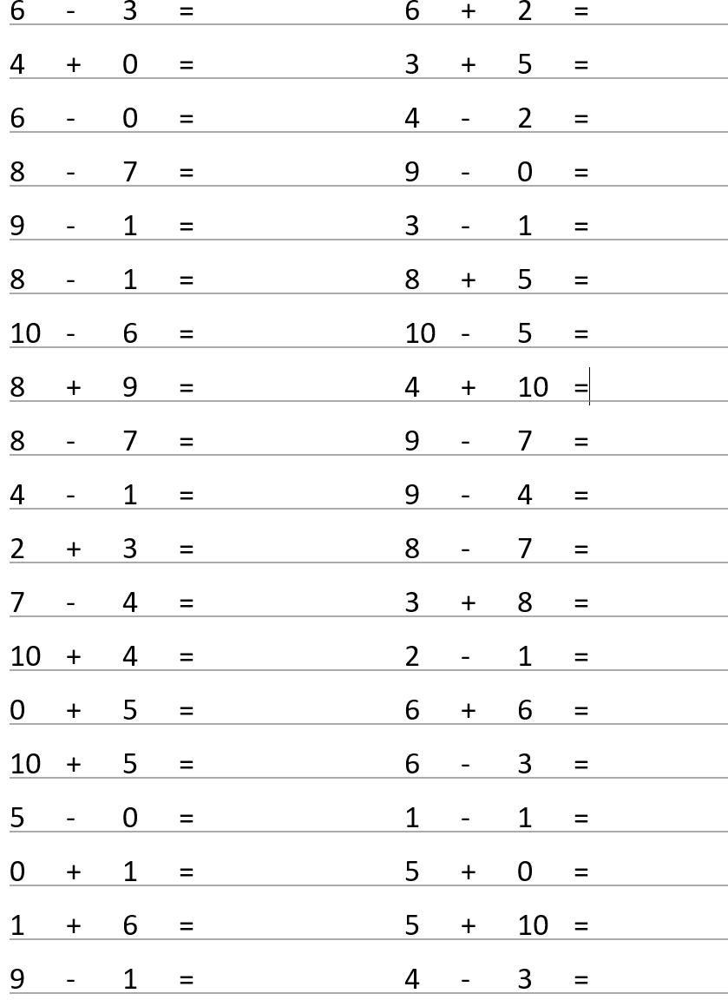

## Math exercise generator

The python program generates some arithmetic exercise for kid, supported operators including '+', '-', 'x', and you can specify the range of operands. 

## Usage
  * [optional] Change the parametors of generate_exercise.py if you want to change the range of operands or type of operators. 
  * run program by running ```python generate_exercise.py```
  * copy the numbers saved in numbers.txt to numbers.docx and print it.

## Generated exercise example.

